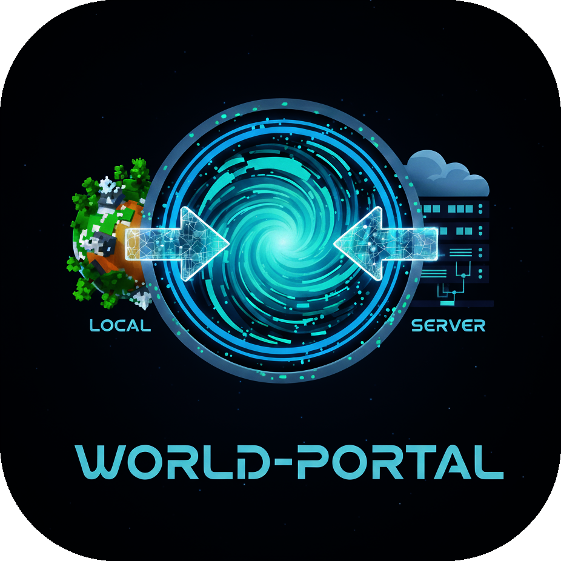
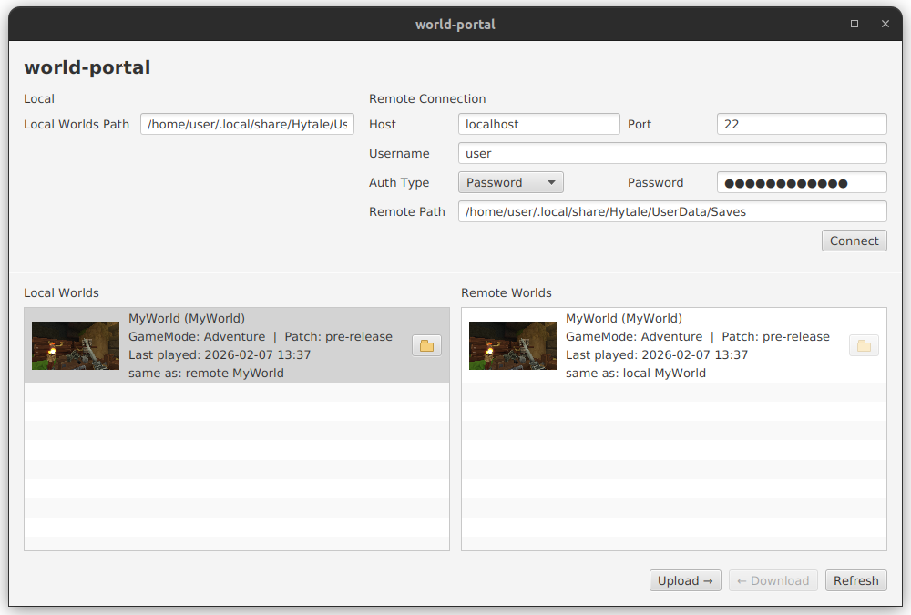

<p align="center">
  
</p>

# World Portal

Desktop App to move Hytale worlds between your local installation and an SSH server.

## For Users

### Features
- Connect to SSH server with password or public key authentication
- Browse local and remote world lists
- Show world metadata in lists (name, folder id, preview image, last played, game mode, patch line)
- Upload/download included world content over SFTP
- Auto-rename on conflict (`WorldName_1`, `WorldName_2`, ...)
- Open local world folder in your OS file explorer
- Open world details via double-click on a world item
- Edit `whitelist.json` in details window:
  - enable/disable whitelist
  - add/remove player UUIDs

### Transferred World Content
The app transfers only this subset of world content:
- `bans.json`
- `client_metadata.json`
- `config.json`
- `mods/`
- `permissions.json`
- `preview.png`
- `universe/`
- `whitelist.json`
- `logs/`




## For Developers

### Run
With Gradle wrapper:

```bash
./gradlew run
```

### Build

```bash
./gradlew build
```

### Package for Distribution
Build app image:

```bash
./gradlew packageAppImage -PjpackageType=app-image
```

Build Windows installer:

```bash
./gradlew packageAppImage -PjpackageType=exe
```

Output:

```text
build/jpackage/out
```

### Tech Stack
- Java 23+
- Gradle 8.x
- JavaFX 25
- JSch 2.27.2
- JUnit 5
